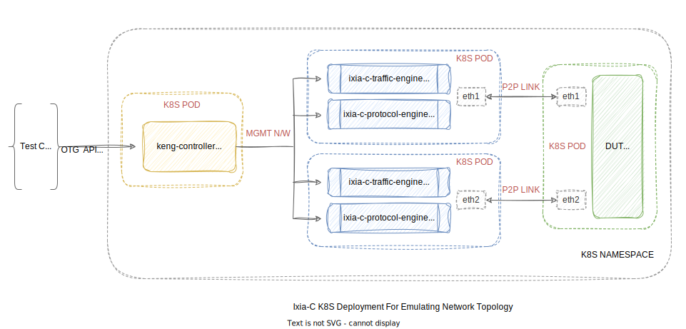

# Ixia-C Kubernetes Deployment For Emulating Network Topology

Ixia-C is a pure software-based solution for facilitating protocol emulation and traffic generation against containerized DUTs (Device Under Test).

<p align="center">

</p>

For deployment, K8S (Kubernetes) as a platform can be exercised using one of following approaches:
- Manually construct K8S deployment files for any given topology
- Use [KNE](https://github.com/openconfig/kne) to automate deployment using an abstract topology definition

This document discusses the first approach using a minimal Ubuntu container as DUT.

### Overview

Ixia-C is distributed as a multi-container application with following as core components:
1. `keng-controller`: API Server driving operation on one or more test port based on API requests
2. `ixia-c-traffic-engine`: Drives data plane operations on test port
3. `ixia-c-protocol-engine`: Drives control plane operations on test port

Upon deployment, `ixia-c-traffic-engine` and `ixia-c-protocol-engine` need to share same network namespace and hence constitute an Ixia-C Test Port Pod. A typical deployment consists of one `controller pod` and one or more `test port pod`s.

To establish any meaningful interaction between Ixia-C test ports and DUT interfaces, following needs to be done:
- A pair of virtual interfaces need to be created, each on an Ixia-C test port pod and DUT pod
- The interface pair then needs to have a P2P (point-to-point) link established among themselves

To achieve this, we'll be using [Meshnet CNI](https://github.com/networkop/meshnet-cni).


### Prerequisites

- At least **2 x86 CPU cores**, **7GB RAM** and **30GB Free Hard Disk Space**
- Recommended OS is **Ubuntu 22.04 LTS** release.
- Go **1.20+**
- **Docker Engine** (Community Edition) - Needed when using kind for setting up K8S cluster

### Steps

1. Clone this repository

    ```bash
    git clone --recurse-submodules https://github.com/open-traffic-generator/ixia-c.git && cd ixia-c
    ```

2. (Optional) Setup a Kubernetes Cluster using [kind](https://kind.sigs.k8s.io/)

    ```bash
    # install kind
    go install sigs.k8s.io/kind@v0.20.0

    # create a single-node cluster
    kind create cluster --config=deployments/k8s/network-emulation/kind.yaml --wait 30s

    # get compatible kubectl
    sudo docker cp kind-control-plane:/usr/bin/kubectl /usr/local/bin/kubectl
    sudo chmod 0755 /usr/local/bin/kubectl

    # ensure all pods are ready
    kubectl wait --for=condition=Ready pods --all --all-namespaces
    ```

3. (Optional) If cluster does not have access to ghcr.io, manually download container images and push them to all nodes in the cluster

    ```bash
    # Enter Github user ID and PAT when asked for credentials
    docker login ghcr.io

    # download ixia-c images
    docker pull ghcr.io/open-traffic-generator/keng-controller:1.5.0-1
    docker pull ghcr.io/open-traffic-generator/ixia-c-traffic-engine:1.8.0.7
    docker pull ghcr.io/open-traffic-generator/ixia-c-protocol-engine:1.00.0.382

    # download DUT image
    docker pull ubuntu:22.04

    # download meshnet image
    docker pull networkop/meshnet:latest
    # download init image
    docker pull networkop/init-wait:latest

    # push images to nodes
    kind load docker-image ghcr.io/open-traffic-generator/keng-controller:1.5.0-1
    kind load docker-image ghcr.io/open-traffic-generator/ixia-c-traffic-engine:1.8.0.7
    kind load docker-image ghcr.io/open-traffic-generator/ixia-c-protocol-engine:1.00.0.382
    kind load docker-image ubuntu:22.04
    kind load docker-image networkop/meshnet:latest
    kind load docker-image networkop/init-wait:latest

    # make sure all intended images have been pushed correctly
    docker exec kind-control-plane crictl images
    ```

4. Setup meshnet

    ```bash
    # Clone and checkout tested version of meshnet
    git clone https://github.com/networkop/meshnet-cni
    cd meshnet-cni && git checkout f26c193 && cd -

    # Deploy meshnet
    kubectl apply -k meshnet-cni/manifests/base

    # wait for meshnet pods
    kubectl wait --for=condition=Ready pods -n meshnet --all
    ```

5. Create virtual interfaces and P2P link using meshnet

    The deployment file to be applied specifies name of test port pods and dut pod, interfaces to be created inside each of them and corresponding peer interface to create P2P link with.

    ```bash
    # create meshnet CRD
    kubectl apply -f deployments/k8s/network-emulation/namespace.yaml
    kubectl apply -f deployments/k8s/network-emulation/links.yaml

    # ensure meshnet CRD is successfully created (should list three entries)
    kubectl get topologies -A
    ```

6. Create Ixia-C / DUT pods and services

    ```bash
    # Create pods and services
    kubectl apply -f deployments/k8s/network-emulation/pods.yaml
    kubectl apply -f deployments/k8s/network-emulation/services.yaml

    # Wait for pods and list pods / services
    kubectl wait --for=condition=Ready pods -n ixia-c --all
    kubectl get pods -n ixia-c
    kubectl get services -n ixia-c
    ```

7. Run IPv4 forwarding test using [snappi](https://github.com/open-traffic-generator/snappi/tree/main/gosnappi) which is an auto-generated SDK based on [Open Traffic Generator API](https://redocly.github.io/redoc/?url=https://raw.githubusercontent.com/open-traffic-generator/models/master/artifacts/openapi.yaml&nocors)

    The test parameters, e.g. location of KENG controller, name of interfaces, etc. can be modified inside `testConst` map in `ipfwd.go`.

    Check the file for more details on the test.

    ```bash
    cd deployments/k8s/network-emulation/
    go run ipfwd.go
    cd -
    ```

8. (Optional) Cleanup

    ```bash
    # remove cluster if deployed using kind
    kind delete cluster
    sudo rm -rf /usr/local/bin/kubectl

    # remove pods / services / CRDs
    kubectl delete -f deployments/k8s/network-emulation/services.yaml
    kubectl delete -f deployments/k8s/network-emulation/pods.yaml
    kubectl delete -f deployments/k8s/network-emulation/links.yaml
    kubectl delete -f deployments/k8s/network-emulation/namespace.yaml
    ```

### What's Next ?

- Checkout Ixia-C Release Page to get compatible client and server builds.
    * [All Releases](https://github.com/open-traffic-generator/ixia-c/releases)
    * [Latest Release](https://github.com/open-traffic-generator/ixia-c/releases/latest)
- Checkout [OTG Conformance Tests](https://github.com/open-traffic-generator/conformance) for examples on various OTG features written in Go and Python.
- Checkout [OTG Examples](https://github.com/open-traffic-generator/otg-examples) for more comprehensive examples / labs.
