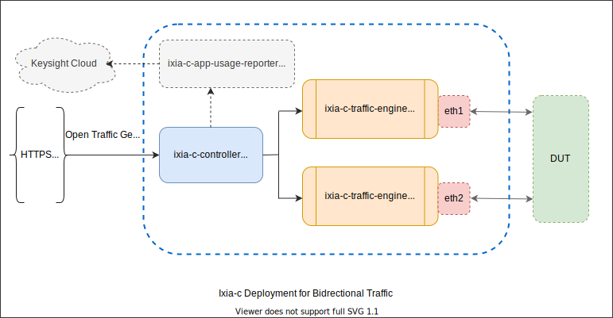

# Deployment Guide

- [Table of Contents](readme.md)
  - Deployment Guide
    * [Overview](#overview)
    * [Bootstrap](#bootstrap)
    * [Deployment Parameters](#deployment-parameters)
    * [Diagnostics](#diagnostics)
    * [Test Suite](#test-suite)
    * [One-arm Scenario](#one-arm-scenario)
    * [Two-arm Scenario](#two-arm-scenario)
    * [Three-arm Mesh Scenario](#three-arm-mesh-scenario)

### Overview

Ixia-c is distributed / deployed as a multi-container application consisting of following services:

* **controller** - Serves API request from clients and manages workflow across one or more traffic engines.
* **traffic-engine** - Generates, captures and processes traffic from one or more network interfaces (on linux-based OS).
* **app-usage-reporter** - (Optional) Collects anonymous usage report from controller and uploads it to Keysight Cloud, with minimal impact on host resources.

All these services are available as docker image on [ixiacom repository](https://hub.docker.com/u/ixiacom). Please check [Ixia-c Releases](releases.md) to use specific versions of these images.

<div align="center">
  </img>
</div>

> Once the services are deployed, [snappi-tests](https://github.com/open-traffic-generator/snappi-tests/tree/eaceaa7), a collection of [snappi](https://pypi.org/project/snappi/) test scripts and configurations, can be setup to run against Ixia-c.

### Bootstrap

Ixia-c services can either all be deployed on same host or each on separate hosts (as long as they're mutually reachable over network). There's no boot-time dependency between them, which allows for **horizontal scalability** without interrupting existing services.

Following outlines how connectivity is established between the services:

* **controller & traffic-engine** - When client pushes a traffic configuration to controller containing `location` of traffic engine.
* **controller & app-usage-reporter** - Controller periodically tries to establish connectivity with app-usage-reporter on a `location` which can be overridden using controller's deployment parameters.

The **location** (aka network address) of traffic-engine and app-usage-reporter must be reachable from controller, even if they're not reachable from client scripts.

#### Using docker-compose

Deploying multiple services manually (along with required parameters) may not be desired in some scenarios and hence, for convenience [deployments](../deployments) directory consists of `docker-compose` files, where:
* `*.yml` files describe services for a given scenario and deployment parameters required to start them.
* `.env` file holds default parameters to be used across all `*.yml` files, like name of interface, version of docker images, etc.

If a concerned `.yml` file does not include certain variables from `.env`, those can then safely be ignored.  
Here's how the usual workflow looks like when using `docker-compose`.

```sh
# change default parameters if needed; e.g. interface name, image version, etc.
vi deployments/.env
# deploy and start services
docker-compose -f deployments/<scenario>.yml up -d
# stop and remove services deployed
docker-compose -f deployments/<scenario>.yml down
```

On most systems, `docker-compose` needs to be installed separately even when docker is already installed. Please check [docker prerequisites](prerequisites.md#docker) for more details.

>All the scenarios mentioned in upcoming sections describe both manual and automated (requiring docker-compose) steps.

### Deployment Parameters

#### Controller

  | Controller Parameters       | Optional  | Default                 | Description                                                     |
  |-----------------------------|-----------|-------------------------|-----------------------------------------------------------------|
  | --debug                     |   Yes     | false                   | Enables high volume logs with debug info for better diagnostics.|
  | --disable-app-usage-reporter|   Yes     | false                   | Disables sending usage data to app-usage-reporter.              |
  | --http-port                 |   Yes     | 443                     | TCP port for HTTP server.                                       |
  | --aur-host                  |   Yes     | https://localhost:5600  | Overrides location of app-usage-reporter.                       |
  | --accept-eula               |   No      | NA                      | Indicates that user has accepted EULA, otherwise controller won't boot up |

  Docker Parameters:
  * `--net=host` - This is recommended to allowing using host's network stack in order to address traffic-engine containers using `localhost` instead of `container-ip`, when deployed on same host.
  * `-d` - This starts container in background.

  Example:

  ```bash
  docker run --net=host -d ixiacom/ixia-c-controller --accept-eula --debug --http-port 5050
  ```

#### Traffic Engine

  | Environment Variables       | Optional  | Default                 | Description                                                     |
  |-----------------------------|-----------|-------------------------|-----------------------------------------------------------------|
  | ARG_IFACE_LIST              |   No      | NA                      | Name of the network interface to bind to. It must be visible to traffic-engine's network namespace. e.g. `virtual@af_packet,eth1` where `eth1` is interface name while `virtual@af_packet` indicates that the interface is managed by host kernel's network stack.|
  | OPT_LISTEN_PORT             |   Yes     | "5555"                  | TCP port on which controller can establish connection with traffic-engine.|
  | OPT_NO_HUGEPAGES            |   Yes     | "No"                    | Setting this to `Yes` disables hugepages in OS. The hugepages needs to be disabled when using network interfaces managed by host kernel's stack.|

  Docker Parameters:
  * `--net=host` - This is needed if traffic-engine needs to bind to a network interface that is visible in host network stack but not inside docker's network.
  * `--privileged` - This is needed because traffic-engine needs to exercise capabilities that require elevated privileges.
  * `--cpuset-cpus` - The traffic-engine usually requires 1 shared CPU core for management activities and 2 exclusive CPU cores, each for transmit engine and receive engine. The shared CPU core can be shared across multiple traffic-engines. e.g. `--cpuset-cpus="0,1,2"` indicates that cpu0 is shared, cpu1 is used for transmit and cpu2 is used for receive. If CPU cores are not specified, arbitrary CPU cores will be chosen.
    > If enough CPU cores are not provided, available CPU cores may be shared among management, transmit and receive engines, occasionally resulting in lower performance.
  * `-d` - This starts container in background.

  Example:

  ```bash
  docker run --net=host --privileged -d         \
    -e OPT_LISTEN_PORT="5555"                   \
    -e ARG_IFACE_LIST="virtual@af_packet,eth1"  \
    -e OPT_NO_HUGEPAGES="Yes"                   \
    --cpuset-cpus="0,1,2"                       \
    ixiacom/ixia-c-traffic-engine
  ```

### Diagnostics

Check and download controller logs:

```sh
docker exec <container-id> cat logs/controller.log
# follow logs
docker exec <container-id> tail -f logs/controller.log
# check stdout output
docker logs <container-id>
# download logs
docker cp <container-id>:$(docker exec <container-id> readlink -f logs/controller.log) ./
```

Check and download traffic-engine logs:

```sh
docker exec <container-id> cat /var/log/usstream/usstream.log
# follow logs
docker exec <container-id> tail -f /var/log/usstream/usstream.log
# check stdout output
docker logs <container-id>
# download logs
docker cp <container-id>:/var/log/usstream/usstream.log ./
```

### Test Suite

### One-arm Scenario

> TODO: diagram

* Automated

  ```bash
  docker-compose -f deployments/raw-one-arm.yml up -d
  # optionally stop and remove services deployed
  docker-compose -f deployments/raw-one-arm.yml down
  ```

* Manual

  ```bash
  # start controller and app usage reporter
  docker run --net=host -d ixiacom/ixia-c-controller --accept-eula
  docker run --net=host -d ixiacom/ixia-c-app-usage-reporter

  # start traffic engine on network interface eth1, TCP port 5555 and cpu cores 0, 1, 2
  docker run --net=host --privileged -d         \
    -e OPT_LISTEN_PORT="5555"                   \
    -e ARG_IFACE_LIST="virtual@af_packet,eth1"  \
    -e OPT_NO_HUGEPAGES="Yes"                   \
    --cpuset-cpus="0,1,2"                       \
    ixiacom/ixia-c-traffic-engine
  ```

### Two-arm Scenario

> TODO: diagram

* Automated

  ```bash
  docker-compose -f deployments/raw-two-arm.yml up -d
  # optionally stop and remove services deployed
  docker-compose -f deployments/raw-two-arm.yml down
  ```

* Manual

  ```bash
  # start controller and app usage reporter
  docker run --net=host -d ixiacom/ixia-c-controller --accept-eula
  docker run --net=host -d ixiacom/ixia-c-app-usage-reporter

  # start traffic engine on network interface eth1, TCP port 5555 and cpu cores 0, 1, 2
  docker run --net=host --privileged -d         \
    -e OPT_LISTEN_PORT="5555"                   \
    -e ARG_IFACE_LIST="virtual@af_packet,eth1"  \
    -e OPT_NO_HUGEPAGES="Yes"                   \
    --cpuset-cpus="0,1,2"                       \
    ixiacom/ixia-c-traffic-engine

  # start traffic engine on network interface eth2, TCP port 5556 and cpu cores 0, 3, 4
  docker run --net=host --privileged -d         \
    -e OPT_LISTEN_PORT="5556"                   \
    -e ARG_IFACE_LIST="virtual@af_packet,eth2"  \
    -e OPT_NO_HUGEPAGES="Yes"                   \
    --cpuset-cpus="0,3,4"                       \
    ixiacom/ixia-c-traffic-engine
  ```

### Three-arm Mesh Scenario

This scenario binds traffic engine to management network interface belonging to the container which in turn is part of docker0 network.

> TODO: diagram

* Automated

  ```bash
  docker-compose -f deployments/raw-three-arm-mesh.yml up -d
  # optionally stop and remove services deployed
  docker-compose -f deployments/raw-three-arm-mesh.yml down
  ```

* Manual

  ```bash
  # start controller and app usage reporter
  docker run --net=host -d ixiacom/ixia-c-controller --accept-eula
  docker run --net=host -d ixiacom/ixia-c-app-usage-reporter

  # start traffic engine on network interface eth0, TCP port 5555 and cpu cores 0, 1, 2
  docker run --privileged -d                    \
    -e OPT_LISTEN_PORT="5555"                   \
    -e ARG_IFACE_LIST="virtual@af_packet,eth0"  \
    -e OPT_NO_HUGEPAGES="Yes"                   \
    -p 5555:5555                                \
    --cpuset-cpus="0,1,2"                       \
    ixiacom/ixia-c-traffic-engine

  # start traffic engine on network interface eth0, TCP port 5556 and cpu cores 0, 3, 4
  docker run --privileged -d                    \
    -e OPT_LISTEN_PORT="5555"                   \
    -e ARG_IFACE_LIST="virtual@af_packet,eth0"  \
    -e OPT_NO_HUGEPAGES="Yes"                   \
    -p 5556:5555                                \
    --cpuset-cpus="0,3,4"                       \
    ixiacom/ixia-c-traffic-engine

  # start traffic engine on network interface eth0, TCP port 5557 and cpu cores 0, 5, 6
  docker run --privileged -d                    \
    -e OPT_LISTEN_PORT="5555"                   \
    -e ARG_IFACE_LIST="virtual@af_packet,eth0"  \
    -e OPT_NO_HUGEPAGES="Yes"                   \
    -p 5557:5555                                \
    --cpuset-cpus="0,5,6"                       \
    ixiacom/ixia-c-traffic-engine
  ```

### TODO: Multi-port per TE container

## Tests

### Clone Tests

  ```sh
    # Git clone sanppi-tests repo from github
    # This repository consists of end-to-end test scripts written in [snappi](https://github.com/open-traffic-generator/snappi).
    git clone https://github.com/open-traffic-generator/snappi-tests.git
    cd snappi-tests
  ```

### Setup Tests

  Please make sure that the client setup meets [Python Prerequisites](#test-prerequisites).

* **Install `snappi`.**

    ```sh
      python -m pip install --upgrade "snappi"
    ```

* **Install test dependencies**

    ```sh
      python -m pip install --upgrade -r requirements.txt
    ```

* **Ensure a `sample test` script executes successfully. Please see [test details](#test-details) for more info.**

    ```sh
      # provide intended API Server and port addresses
      vi tests/settings.json
      # run a test
      python -m pytest tests/raw/test_tcp_unidir_flows.py
    ```

## Test Details

The test scripts are based on `snappi client SDK` (auto-generated from [Open Traffic Generator Data Model](https://github.com/open-traffic-generator/models)) and have been written using `pytest`.  

Open Traffic Generator Data Model can be accessed from any browser by hitting this url (https://<controller-host-ip>/docs/) and start scripting.

The test directory structure is as follows:

* `snappi-tests/tests/settings.json` - global test configuration, includes `controller` host, `traffic-engine` host and `speed` settings.
* `snappi-tests/configs/` - contains pre-defined traffic configurations in JSON, which can be loaded by test scripts.
* `snappi-tests/tests` - contains end-to-end test scripts covering most common use-cases.
* `snappi-tests/tests/utils/` - contains most commonly needed helpers, used throughout test scripts.
* `snappi-tests/tests/env/bin/python` - python executable (inside virtual environment) to be used for test execution.

Most test scripts follow the format of following sample scripts:

* `snappi-tests/tests/raw/test_tcp_unidir_flows.py` - for unidirectional flow use case.
* `snappi-tests/tests/raw/test_tcp_bidir_flows.py` - for using pre-defined JSON traffic config & bidirectional flow use case.
* `snappi-tests/tests/raw/test_basic_flow_stats.py` - for basic flow statistics validation use case.
* `<test to validate capture>` - for validating capture. TODO
* `<test to cover multiple protocol fields for different variation like fixed, list, counter>` - some example from gtpv2 [ethernet - ipv4 - udp - gtpv2 - ipv6] TODO
* `<test script for one arm testing>` - for one arm scenario TODO

To execute batch tests marked as `sanity`:

```sh
tests/env/bin/python -m pytest tests/py -m "sanity"
```

**NOTE on tests/settings.json**:

* When `controller` and `traffic-engine`s are located on separate systems (remote)

  ```json
  {
   "controller": "https://<controller-ip>",
    "ports": [
        "<traffic-engine-ip>:5555",
        "<traffic-engine-ip>:5556"
    ]
  }
  ```

* When `controller` and `traffic-engine`s are located on same system (local - raw sockets)

  ```json
  {
   "controller": "https://localhost",
    "ports": [
        "localhost:5555",
        "localhost:5556"
    ]
  }
  ```
