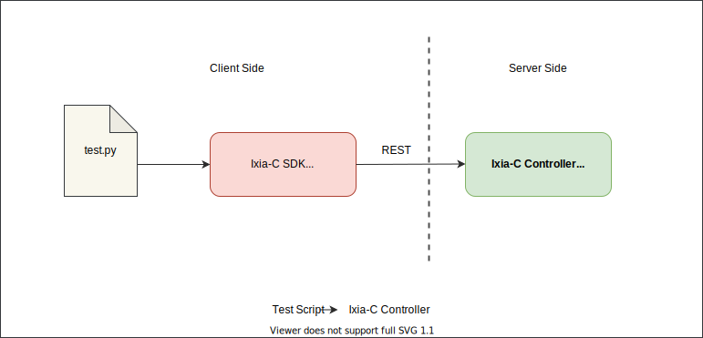
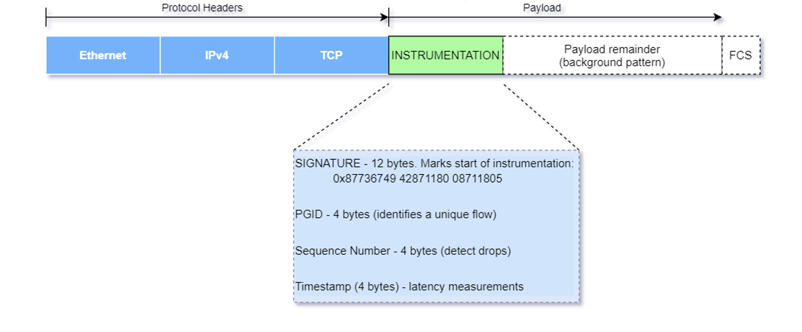

# FAQ

- [Table of Contents](readme.md)
  - FAQ
    - [Ixia-c, Open Traffic Generator and snappi](#ixia-c-open-traffic-generator-and-snappi)
    - [Diagnostics](#diagnostics)
    - [Packets](#packets)
    - [Application Usage Reporter](#application-usage-reporter)
    - [Ixia-c Free Version](#Ixia-c-free-version)
    - [Troubleshooting](#troubleshooting)
    - [Support](#support)

## Ixia-c, Open Traffic Generator and snappi

What is the relationship between Open Traffic Generator data models, snappi and Ixia-c?

 

The [Open Traffic Generator](https://github.com/open-traffic-generator/models) data models describe a vendor neutral data models and APIs for test traffic generation.  The models are based on OpenAPI v3.  Ixia-c is a traffic generator that complies with these APIs.  [snappi](https://github.com/open-traffic-generator/snappi) is a *Pythonic* client library that can be used to write tests that run against Ixia-c.

The following two diagrams illustrate this relationship.

   
  </img>

 

   
  </img>

 

Where can I find a tutorial on <i>snappi</i>?

 

The [Hello snappi](hello-snappi.md) tutorial is a good starting point to get familiar with `snappi`.  

How to use other non-Python clients?

 

TODO: Fill in details here.

Can I use <i>curl</i> to control Ixia-c?

 

Yes.  Refer to the [Quick Start](../readme.md##quick-start) on the Ixia-c home page.

## Diagnostics

What version of the Open Traffic Generator spec does Ixia-c implement?

 

Ixia-c implements version **[v0.9.1](https://github.com/open-traffic-generator/models/releases/tag/v0.9.1)** of the Open Traffic Generator Data Model. You can view the model [here](https://redocly.github.io/redoc/?url=https://raw.githubusercontent.com/open-traffic-generator/models/v0.9.1/artifacts/openapi.yaml).

How to find version of Open Traffic Generator spec implemented by Ixia-c?

 

Open Traffic Generator Data Model can be accessed from any browser by pointing it to (https://\<controller-host-ip\>/docs/openapi.json).  The `info` section contains the `version` of the Open Traffic Generator Data Model implemented by the Ixia-c controller.

## Packets

What do packets look like?

 

Ixia packet testers utilize a proprietary flow-tracking technique which involves inserting a special *instrumentation header* into the packet.  It is inserted after the last valid protocol header ie, in the payload.  

   
  </img>

 

The fields in this header are:

- a *signature* which servers as marker to indicate start of header
- a *PGID* or *port group id* field to distinguish between different flows
- a 32 bit *sequence number* that can be used to detect packet re-ordering
- a 32 bit timestamp that can be used to measure one-way latency

How do I disable packet instrumentation?

 

According to the Open Traffic Generator data model packet instrumentation is enabled by default on all the flows.  It is not possible to disable it at the moment.  An update to the data model that allows the end user to disable instrumentation is in the process of being merged into the *main* branch and will be submitted in the coming weeks.  Ixia-c will implement it at that point.

Does Ixia-c calculate packet checksums?  If so, which ones?

 

Yes, the Ixia-c traffic-engine automatically calculates the Ethernet FCS, IPv4, TCP and UDP checksums.  The traffic-engine is capable of calculating *four* checksums (in each packet).  TODO: verify.

What <i>layer1</i> settings does Ixia-c utilize?

 

The only `layer1` setting that is used by the Ixia-c traffic engine is `speed`.  This setting is used to help convert flow rate specified as *percentage line-rate* into packets/second (pps) and to ensure that proper inter-packet-gaps are used.

What is the purpose of the <i>layer1</i> setting <i>speed</i>?

 

To calculate packets/second (pps) when the flow rate is specified as *percentage line-rate* and to ensure proper inter-packet-gaps.

## Application Usage Reporter

What is <i>Application Usage Reporter</i>?

 

The `app-usage-reporter` container collects and uploads to the Keysight cloud some basic telemetry information from the Ixia-c controller.  This information helps Keysight improve the controller by focusing on the features that are being used by end users.

What information does <i>Application Usage Reporter</i> collect?

 

The *Application Usage Reporter* collects configuration related information like the number of ports in a test, number of flows configured, number of values used in a pattern. TODO:  Need to give an exhaustive list.

Does <i>Application Usage Reporter</i> collect any personally identifiable information?

 

No.  The *Application Usage Reporter* does NOT collect any personally identifiable information like username, hostname, email address, etc.

Does <i>Application Usage Reporter</i> save my IP address?

 
No.

Can I disable <i>Application Usage Reporter</i>? If so, how?

 

Yes, the *Application Usage Reporter* can be disabled.  Refer to the [Deployment Parameters](deployments.md#deployment-parameters) section in the Deployment Guide.

## Ixia-c Free Version

What are the limitations of the free version of Ixia-c?

 

The free version of Ixia-c controller supports up to 4 ports in one session and the Ixia-c traffic-engine is limited to running over `raw` sockets.

What are the differences between the commercial and the free version of Ixia-c?

 
The following table highlights the differences between the commercial and the free version of Ixia-c.

| Capability | Ixia-c Free | Ixia-c Commercial |
-------------| ------------| ------------------|
| # of Ports | 4 | Unlimited |
| Traffic Engine - Raw | Supported | Supported |
| Traffic Engine - DPDK PCI | Not Supported | Supported |
| Support | Slack Channel | Keysight Support |

How do I purchase the commercial version of Ixia-c?

 

Contact your Keysight Sales Rep or reach out to us [here](https://www.keysight.com/us/en/contact.html).

## Troubleshooting

How do I view Ixia-c controller logs?

 

Use `docker logs` to view the controller log.

What is the message <i>"App usage reporting service is down"</i> in Ixia-c controller log?

 

This message indicates that the `app-usage-reporter` container is not reachable from the Ixia-c controller.  This does NOT affect Ixia-c controller's normal operation.  Refer to [Deployment Parameters](deployments.md#deployment-parameters) for more details on how to override the default location for the app-usage-reporter or how to disable it all together.

## Support

Where do I get support for the free version of Ixia-c?

 

Reach out to us on [Slack](support.md) for support.

