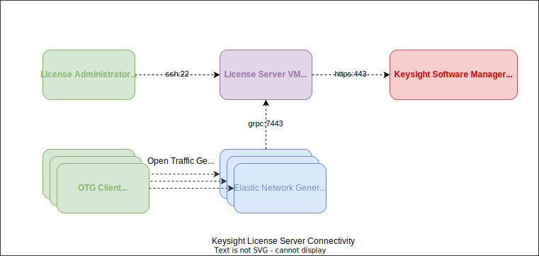

# Licensing

## License Editions

The following License Editions are available for Keysight Elastic Network Generator:

  | Capability                          | Community            | Developer            | Team                           | System                              |
  |-------------------------------------|----------------------|----------------------|--------------------------------|-------------------------------------|
  | Ixia-c Traffic Port Capacity*       |  4 x 1/10GE          |  50GE                |  400GE                         | 800GE                               |
  | Test Concurrency**                  |  1 Seat              |  1 Seat              |  8 Seats                       | 16 Seats                            |
  | Protocol Scale***                   |  Restricted          |  Limited             |  Limited                       | Unlimited                           |
  | Requires a valid license            |  N                   |  Y                   |  Y                             | Y                                   |
  | Includes Ixia-c Software Test Ports |  Y                   |  Y                   |  Y                             | Y                                   |
  | Works with UHD400T Hardware         |  N                   |  N                   |  Y                             | Y                                   |
  | Works with IxOS Hardware            |  N                   |  N                   |  N                             | Y                                   |

 The **Ixia-c Traffic Port Capacity** is determined as a sum of the configured Ixia-c test port speeds with the possible values of: 100GE, 50GE, 40GE, 25GE, 10GE, and 1GE. The Maximum data plane performance of an Ixia-c port may be less than the configured port speed, depending on the capabilities of the underlying hardware and software drivers.

 The **Test seat concurrency** applies to a number of controller instances that are running with a configuration that exceeds the capabilities of the Community Edition.

 The **Restricted** protocol scale supports the maximum of 4 BGP sessions per test.

 The Capabilities of the **Limited** protocol scale depend on the protocol. For details, contact [Keysight Support](https://support.ixiacom.com/contact/support).

 Keysight Elastic Network Generator can simultaneously consume multiple licenses to increase the capabilities of a test. For example, if the Ixia-c Traffic Port Capacity configured in one test is 100GE, two Developer licenses will be consumed if available.

 If you require capabilities beyond those provided by the Community Edition, use [Keysight Elastic Network Generator](https://www.keysight.com/us/en/products/network-test/protocol-load-test/keysight-elastic-network-generator.html) product page to request an evaluation or a quote.

## License Server

Keysight uses a license server to manage floating or network shared licenses for its software products. The license server enables licenses to float and not be tied to a specific Elastic Network Generator instance.
The Elastic Network Generator controllers **must** be able to reach the License server.

## Requirements

### Network connectivity

1. Internet access from the Keysight License server VM over HTTPS to the Keysight Software Manager (KSM) service [https://ksm.software.keysight.com/](https://ksm.software.keysight.com/) is desirable for the online license activation, but it is not required.
The Alternative offline activation method is available, and it only requires a license administrator to have the access to KSM.
2. Access from a license administrator's computer over SSH (TCP/22) for license operations (activation, deactivation, reservation, and sync).
3. Access from any Keysight Elastic Network Generator `ixia-c-controller` container that needs a license during a test run over the gRPC (TCP/7443) for license checkout and check-in.

The diagram below illustrates how the different components communicate with the License server:



### System requirements – KVM

The License server VM resource requirements when running on the KVM hypervisor are as follows:

* 2 CPU cores
* 4 GB of RAM
* Minimum 10GB of storage
* 1 available physical bridged adapter on KVM for management connectivity

Before deployment, make sure that the KVM hypervisor is properly installed and configured in Ubuntu 20.04.

The following settings are required on Ubuntu:

* Update repositories:
    ```sh
    sudo apt update
    ```

* Install required KVM packages:
    ```sh
    sudo apt -y install qemu-kvm libvirt-daemon-system libvirt-clients libvirt-daemon bridge-utils qemu-guest-agent virt-manager vim cifs-utils

    ```

## Deployment

### KVM

1. Download the following license server VM deployment script:

 	 `license_server_kvm.sh`

	and use the following commands to run the script and deploy the VM:

    ```sh
    # Download script
    curl -o license_server_kvm.sh https://<location>/ixia_c_license_server_kvm_release.sh

    # Change permission
    chmod u+x license_server_kvm.sh

    # Usage of parameter options
    ./license_server_kvm.sh -h

    # Install License server VM (default)
    ./license_server_kvm.sh

    # Install License server VM with parameters
    ./license_server_kvm.sh \
        vm_name \
        ip_address netmask gateway dns_server \
        ssh_public_key_file \
        bridge
    ```

    Installation parameters:

    | Parameters            |Description  |
    |-----------------------|--------------|
    | `vm_name`             | Name assigned to the VM   |
    | `ip_address`          | IP address assigned to the VM. Can be either a static IP address \(such as: 1.2.3.4\) or "DHCP"     |
    | `netmask`             | Netmask used by the VM, in dotted-decimal format \(such as: 1.2.3.4\) or "DHCP"     |
    | `gateway`             | Gateway IP address for this VM. Can be either a static IP address \(such as: 1.2.3.4\) or "DHCP"     |
    | `dns_server`          | The DNS Server used for this VM, can be "DHCP" or a static IP address \(such as: 8.8.8.8\)      |
    | `ssh_public_key_file` | The path to an SSH Key file that the "license_cli" user will use to access this VM. If you enter the string "AUTO", the installtion script will call 'ssh-keygen -b 1024 -t rsa -f id_rsa -P' and use the resulting file "id_rsa.pub" as the input to the generated VM. |
    | `bridge`              | Bridge that the VM network interface will use. Can be "AUTO" or any named bridge.  If set to"AUTO", the default bridge "virbr0" will be used. If set to anything else, the named bridge will be used \(such as: br0\).   |

2. Start the license server service in the VM:

    ```sh
    # ssh to license cli using SSH key
    ssh -i id_rsa license_cli@<license_server_ip_address>

    # To check all available Keysight License Server shell commands
    help

    # Start license server service
    start license-server
    ```

## License administration

1. Obtain an activation code from your Keysight Sales Representative or [Keysight Support](https://support.ixiacom.com/contact/support).
2. On the license server VM, SSH to license cli using the SSH key:
    ```sh
    ssh -i id_rsa license_cli@<license_server_ip_address>
    ```
3. Activate the license using activation code:
    ```sh
    activate-license XXXX-XXXX-XXXX-XXXX 1
    ```
4. To uninstall (deactivate) a license:
    ```sh
    deactivate-license XXXX-XXXX-XXXX-XXXX 1
    ```

The following commands are available in the Keysight License server shell:

| Commands                                                | Description  |
|---------------------------------------------------------|-----------|
| `show ip`                                                 | Shows the current IP address and netmask information for the management interface     |
| `show licenses`                                           | Shows the currently installed licenses  |
| `show dns-servers`                                        | Shows the DNS servers configured |
| `show license-server-status`                              | Shows the current status of the License Server (active or not active, etc)  |
| `show license-server-auto-start`                          | Shows the status of the "license-server-auto-start" flag  |
| `show dropbox `                                           | Shows the files that are located in the "dropbox".  These are files that can be imported manually |
| `delete (filename)`                                       | Delete the file at "filename" from the "dropbox"  |
| `set ip [interface] [IP/"dhcp"] [netmask] [gateway]`      | Sets the current IP address, netmask and gateway address  |
| `set license-server-auto-start (on/off)`                  | Change the status of the License Server, will it auto start at boot or not  |
| `add dns-server (serverIP) (index)`                       | Add a new DNS server. At this time, the "index" option  must be "1" only, and the provided server will be set as the only DNS server.|
| `start license-server`                                    | Starts the License Server on this system  |
| `stop license-server`                                     | Stops the License Server on this system |
| `activate-license (Activation Code) (Quantity)`           | Adds the selected "Activation Code" of quantity "Quantity" to this License Server |
| `deactivate-license (Activation Code) (Quantity)`         | Removes the selected "Activation Code" of quantity "Quantity" from this License Server  |
| `offline-import (filename)`                               | Import an offline file from the "dropbox".  See "show dropbox"  |
| `reboot (Seconds)`                                        | Reboots the VM in (Seconds) seconds, which is an integer that is at least 10  |
| `shutdown (Seconds)`                                      | Gracefully shuts down the VM in (Seconds) seconds, which is an integer that is at least 10  |
| `tILU [--offline]`                                        | Starts the interactive Text Based License Utility (ILU) on this server.  Use the optional argument "--offline" to go straight into the Offline Operations screen. |