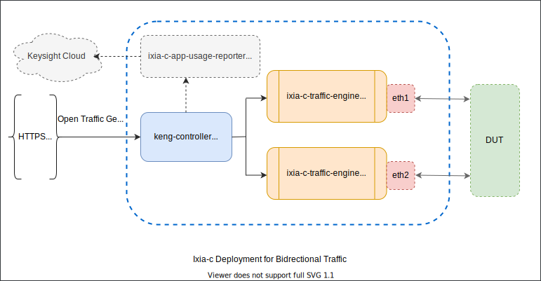

# Deployment

Ixia-c is distributed and deployed as a multi-container application that consists of the following services:

* **controller**: Serves API request from the clients and manages workflow across one or more traffic engines.
* **traffic-engine**: Generates, captures, and processes traffic from one or more network interfaces (on linux-based OS).
* **app-usage-reporter**: (Optional) Collects anonymous usage report from the controller and uploads it to the Keysight Cloud, with minimal impact on the host resources.

All these services are available as docker images on the [GitHub Open-Traffic-Generator repository](https://github.com/orgs/open-traffic-generator/packages). To use specific versions of these images, see [Ixia-c Releases](../releases.md) .



> Once the services are deployed, [snappi-tests](https://github.com/open-traffic-generator/snappi-tests/tree/3ffe20f) (a collection of [snappi](https://pypi.org/project/snappi/) test scripts and configurations) can be setup to run against Ixia-c.

## Deploy Ixia-c using docker-compose

Deploying multiple services manually (along with the required parameters) is not always applicable in some scenarios. For convenience, the [deployments](../deployments) directory consists of the following `docker-compose` files:

- `*.yml`: Describes the services for a given scenario and the deployment parameters that are required to start them.
- `.env`: Holds the default parameters, that are used across all `*.yml` files. For example, the name of the interface, the version of docker images, and etc.

If a concerned `.yml` file does not include certain variables from `.env`, those can then safely be ignored.
Follwoing is the example of a usual workflow, by using  `docker-compose`.

```sh
# change default parameters if needed; e.g. interface name, image version, etc.
vi deployments/.env
# deploy and start services for community users
docker-compose -f deployments/<scenario>.yml up -d
# stop and remove services deployed
docker-compose -f deployments/<scenario>.yml down
```

On most of the systems, `docker-compose` needs to be installed separately even if the docker is already installed. Before you start, ensure that the [docker prerequisites](../prerequisites.md#docker) are met.

For more information on deployment, see [Deployment Guide](../deployments.md).
