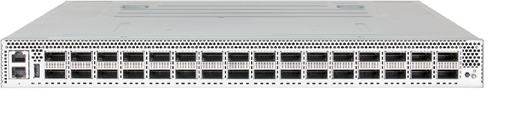

# Introduction

The UHD400T is a high performance, ultra-high density, and highly flexible software defined Tester, for all your next
generation testing needs. It works seamlessly with diverse testbeds like a single Device Under Test, or a network
with multiple devices.

The UHD400T comes as a 1U rack mount appliance with 16 400GE QSFP-DD ports that provide up to 6.4Tbps
composite throughput.

The UHD400T is configurable via the Keysight Elastic Network Generator. During the setup phase, the physical ports
on the UHD400T can be configured through a REST API.



## VLAN-Port Mapping

The UHD400T fabric is preconfigured to route the traffic between the trunk port (port 32) and the traffic ports (1-16).
Ports 17-31 are not available for use in the current release.
When the packets arrive at a traffic port, they are encapsulated in a VLAN corresponding to the front panel (see mapping table below) and routed to the trunk port. The process is reversed, when the packets arrive at the trunk port.

The packets that are encapsulated in a VLAN, are routed to the front panel port corresponding to the VLAN.
The trunk packets that are not VLAN-encapsulated or have a VLAN that is not listed in the following mapping table, will be dropped.


### Mapping Table

| UHD Port | VLAN ID    | UHD Port   | VLAN ID    |
|:---      |:---        |:---        |:---        |
| 1        | 136        |   9        |   320      |
| 2        |  144       |   10       |    312     |
| 3        |  152       |   11       |   304      |
| 4        |   160      |   12       |   296      |
| 5        |   168      |   13       |   288      |
| 6        |  176       |  14        |   280      |
| 7        |   184      |   15       |   272      |
| 8        |    192     |   16       |   264      |

>Note:
The VLAN tagged interfaces can be created by using the following linux command:

```bash
ip link add link <interface-name> name <interface-name>.<vid> type vlan id <vid>
```
For more information, see [UHD400T Getting Started Guide](https://downloads.ixiacom.com/support/downloads_and_updates/public/UHD400T/1.0/1.0.20/UHD400T%20Getting%20Started%20Guide.pdf).
