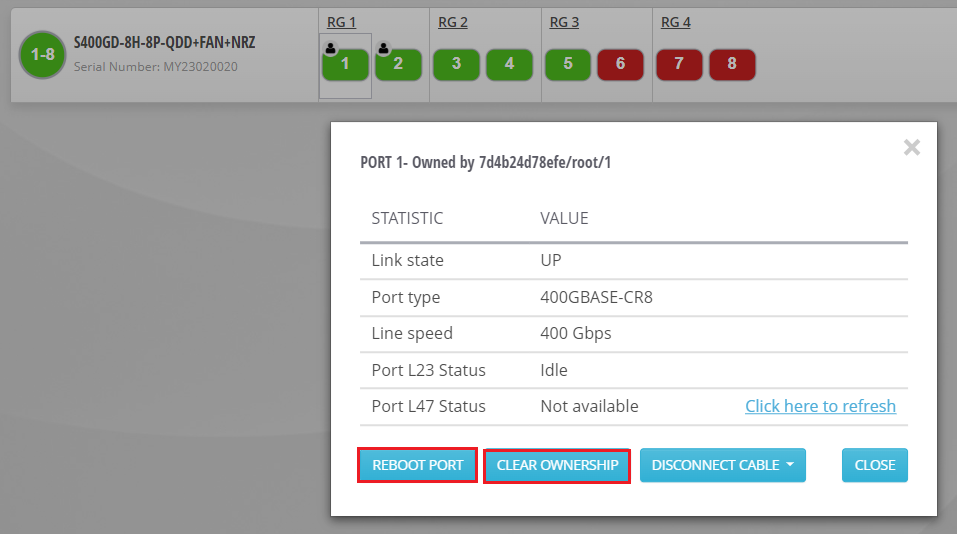

# Troubleshooting

This section explains the troubleshooting scenarios for different environments.

## OTG hardware environment

**<ins>The test fails while it is configuring OTG ports</ins>**: This situation may arise for various reasons. For example, the port ownership is not cleared properly by the previous test, the OTG port went to a bad state, and etc. The course of action in such scenarios can be as follows:

* Manually clear the ownership of the port.
* Reboot the chassis ports.
* Restart the docker containers.
* Use `docker compose` or `docker-compose` to turn the containers down and up.
* Execute the following commands from the directory where you have kept the docker-compose.yaml file.

```sh
docker-compose down
```

```sh
docker-compose up -d
```

**<ins>Configuration is failing port-speed mismatch</ins>**: In this scenario, the OTG port configuration will also fail due to the speed mismatch between the DUT port and the chassis port.
To fix this error, do the following:

* Adjust the DUT port speed to the default port speed of the chassis port.
* Reboot the chassis ports.
* Execute the test.

**<ins>Test failed to take port ownership</ins>**: This error is often obvious from the message that is displayed on the console "Failed to take ownership of the following ports". This situation may occur if the previous test did not clear the ownership or someone else is already owning the port. You can go to the chassis UI and clear the port ownership manually by force.



Execute the actions in the following order:

* Clear ownership
* Reboot ports

**<ins>Error while starting the protocols</ins>**: This error can occur if the ports are in a bad state or if you have ignored some errors that have occurred earlier, when you started the protocol engine.
The error messages may look like:

* Error occurred while starting protocol on the protocol ports:
  Unable to find type:  
  `Ixia.Aptixia.Cpf.pcpu.IsisSRGBRangeSubObjectsPCPU`

* Error occurred while starting protocol on the protocol ports: `GetPortSession()` is NULL.

In this situation, a quick solution is to reboot the ports and restart the docker containers, by following the steps that are described earlier.

>Note:
In summary, clearing the ownership, rebooting the ports, and restarting the containers may resolve many of your problems regarding the ATE port configuration error.

**<ins>OTG API call failed similarly like the start protocol, due to "context deadline exceeded" error</ins>**: You can increase the timeout deadline by changing the value of the **timeout** parameter of the ATE in the binding file. The default value is 30 (in seconds). You can increase it as per your setup.

```sh
  # This option specific to OTG over Ixia-HW.
  otg {
    target: "127.0.0.1:40051" # Change this to the Ixia-c-grpc server endpoint.
    insecure: true
    timeout: 120
  }
```

>Note:
After this change, do not forget to restart the containers and reboot the hardware ports.

## KNE environment

**<ins>Topology creation failures for Ixia-C pods</ins>**: This error can occur for multiple reasons:

* A mismatch in the Ixia-c build versions and the older Operator that is in use. To deploy the correct versions as per the releases, see "<https://github.com/open-traffic-generator/ixia-c/releases>".
* The minimum resource requirement is not met.
* An older version of KNE is being used in the client. To update KNE to a newer release, see "<https://github.com/openconfig/kne/releases/>" and deploy the topology.

**<ins>Test fails due to timeout</ins>**: This error occurs when the test has faced a timeout. By default, the timeout is 10m. You can increase this limit to "-timeout 20m" or can ensure that all the services are reachable for the test to connect and run.

**<ins>Test fails at set config</ins>**: This error occurs if the configuration is not proper. For example, mistake in the flow configuration, BGP LI flag is not enabled but `GetStates` is called, and etc. You can correct the configuration and run the test again.

## UHD environment

**<ins>Test may not run</ins>**: This error can occur for multiple reasons:

* A mismatch in the version of the `ixia-c-protocol-engine` containers and the controller that is in use. Ensure that they are compatible.
* The `ixia-c-protocol-engine` containers (that are deployed) may not be reachable. There are rare cases when you observe that even if the container is running, the exposed port may have gone corrupt. In such scenarios, the only solution is to redeploy the docker containers.
* The UHD ports may not be responsive. When the `ixia-c-protocol-engine` container is ready, ensure that the UHD ports are up. For this, refer to the port-api-service that is provided in the [UHD docs](tests-uhd400.md#vlan-port-mapping).
