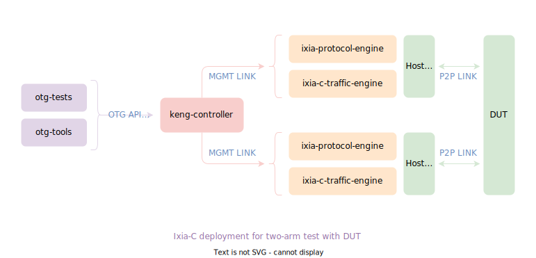

<h1 align="center">
  <br>
  Ixia-c
  <br>
</h1>

<h4 align="center">
  A powerful traffic generator based on <a href="https://github.com/open-traffic-generator/models" target="_blank">Open Traffic Generator API</a>
</h4>

<p align="center">
  <a href="https://github.com/orgs/open-traffic-generator/packages/container/package/ixia-c-controller"></a>
  <a href="https://redocly.github.io/redoc/?url=https://raw.githubusercontent.com/open-traffic-generator/models/v0.10.6/artifacts/openapi.yaml"></a>
  <a href="https://pypi.org/project/snappi/0.10.4"></a>
  <a href="docs/news.md"></a>
  <a href="docs/contribute.md"></a>
  <a href="docs/support.md"></a>
</p>

<p align="center">
  <a href="#quick-demo">Quick Demo</a> &nbsp;•&nbsp;
  <a href="#quick-start">Quick Start</a> &nbsp;•&nbsp;
  <a href="#key-features">Key Features</a> &nbsp;•&nbsp;
  <a href="docs/readme.md">Documentation</a> &nbsp;•&nbsp;
  <a href="docs/usecases.md">Use Cases</a> &nbsp;•&nbsp;
  <a href="docs/roadmap.md">Roadmap</a> &nbsp;•&nbsp;
  <a href="docs/faq.md">FAQ</a>
  <br>
</p>

### What is Ixia-c ?

Ixia-c is a modern, powerful and API-driven traffic generator designed to cater to the needs of hyperscalers, network hardware vendors and hobbyists alike.

It is **available for free** and distributed / deployed as a multi-container application consisting of a [controller](https://github.com/orgs/open-traffic-generator/packages/container/package/ixia-c-controller), a [traffic-engine](https://github.com/orgs/open-traffic-generator/packages/container/package/ixia-c-traffic-engine) and an [app-usage-reporter](https://github.com/orgs/open-traffic-generator/packages/container/package/ixia-c-app-usage-reporter).

As a reference implementation of [Open Traffic Generator API](https://github.com/open-traffic-generator/models), Ixia-c supports client SDKs in various languages, most prevalent being [snappi](https://pypi.org/project/snappi/) (Python SDK).

<p align="center">

</p>

> [Keysight](https://www.keysight.com) also offers a well supported commercial version, [Keysight Elastic Network Generator](https://www.keysight.com/us/en/products/network-test/protocol-load-test/keysight-elastic-network-generator.html), with no restrictions on **performance and scalability**. Scripts written for the free version are **compatible** with this version.

### Quick Demo

<p align="center">

</p>

### Quick Start

Before proceeding, please ensure [system prerequisites](docs/prerequisites.md) are met.

* Deploy Ixia-c

  ```bash
  # start ixia-c controller
  docker run -d --network=host ghcr.io/open-traffic-generator/ixia-c-controller --accept-eula
  docker run --net=host -d ghcr.io/open-traffic-generator/ixia-c-app-usage-reporter

  # start ixia-c traffic engine on eth1 interface
  docker run -d --network=host --privileged     \
    -e ARG_IFACE_LIST="virtual@af_packet,eth1"  \
    -e OPT_NO_HUGEPAGES="Yes"                   \
    ghcr.io/open-traffic-generator/ixia-c-traffic-engine
  ```

  > Once the containers are up, accessing https://controller-ip/docs/ will open up an interactive REST API documentation. Check out [deployment guide](docs/deployments.md) for more details.

* Generate Traffic using [snappi](https://pypi.org/project/snappi/)

  ```bash
  # clone repo for test suites, useful helper scripts, deployment files, etc.
  git clone --recurse-submodules https://github.com/open-traffic-generator/ixia-c && cd ixia-c

  # install snappi
  python -m pip install --upgrade snappi==0.10.4
  # run a standalone script to generate TCP traffic and fetch metrics
  python snappi-tests/scripts/quickstart_snappi.py
  ```

  > Upon successful run, you should see port metrics printed on console.
 
  <details>
  <summary><b>Expand</b> this section for overview of the script we just ran. For more details on snappi, checkout <a href="docs/hello-snappi.md">hello-snappi</a>.</summary>

  ```python
  import snappi
  # create a new API instance over HTTPS transport where location points to controller
  api = snappi.api(location="https://localhost:8443", verify=False)
  # OR
  # create a new API instance over gRPC transport where location points to controller
  api = snappi.api(location="localhost:40051", transport=snappi.Transport.GRPC)

  # create a config object to be pushed to controller
  config = api.config()
  # add a port with location pointing to traffic engine
  prt = config.ports.port(name='prt', location='localhost:5555')[-1]
  # add a flow and assign endpoints
  flw = config.flows.flow(name='flw')[-1]
  flw.tx_rx.port.tx_name = prt.name

  # configure 100 packets to be sent, each having a size of 128 bytes
  flw.size.fixed = 128
  flw.duration.fixed_packets.packets = 100

  # add Ethernet, IP and TCP protocol headers with defaults
  flw.packet.ethernet().ipv4().tcp()

  # push configuration
  api.set_config(config)

  # start transmitting configured flows
  ts = api.transmit_state()
  ts.state = ts.START
  api.set_transmit_state(ts)

  # fetch & print port metrics
  req = api.metrics_request()
  req.port.port_names = [prt.name]
  print(api.get_metrics(req))
  ```

  </details>

* Optionally, Generate Traffic Using [curl](https://curl.se/)

  >We can also pass equivalent **JSON configuration** directly to ixia-c controller, without installing snappi, using **curl**.  
  >The detailed description of each node (and their attributes) in JSON configuration are well documented [here](https://redocly.github.io/redoc/?url=https://raw.githubusercontent.com/open-traffic-generator/models/v0.10.6/artifacts/openapi.yaml).

  ```bash
  # push the contents of config file snappi-tests/configs/quickstart_snappi.json
  curl -k https://localhost:8443/config -H "Content-Type: application/json" -d @snappi-tests/configs/quickstart_snappi.json
  # start transmitting configured flows
  curl -k https://localhost:8443/control/transmit -H  "Content-Type: application/json" -d '{"state": "start"}'
  # fetch all port metrics
  curl -k https://localhost:8443/results/metrics -H  "Content-Type: application/json" -d '{"choice": "port"}}'
  ```

### Key Features

* High Performance
  * Run on servers or Keysight hardware (commercial version only)
  * Generate kbps to Tbps of traffic using same script
  * 10Gbps @ 64 byte frame size using one Xeon class core (commercial version only)
  * Built using [DPDK](https://www.dpdk.org)
* Fast REST API for automation
  * Easily integrate with test frameworks like [pytest](https://www.pytest.org)
  * Easily integrate into CI/CD pipelines with Jenkins, GitHub, GitLab
* Up to 256 flows per port.  Each Flow supports:
  * Packet Templates for Ethernet, VLAN, VXLAN, GTPv1, GTPv2, IPv4, IPv6, ICMP, ICMPv6, GRE, UDP, & TCP.  More protocols are on the way.
  * Ability to use tools like Scapy to add headers for unsupported protocols.
  * Manipulation of any field in the packet headers
  * Patterns to modify common packet header fields to generate millions of unique packets
  * Ability to track flows based on common packet header fields
  * Configurable frame size
  * Rate specification in pps (packets per second) or % line-rate
  * Ability to send bursts
* Statistics
  * Per port and per flow
  * One way latency measurements (min, max, average) on a per flow basis
* Capture
  * Packets with filters
  * Write to PCAP or redirect to tcpdump
